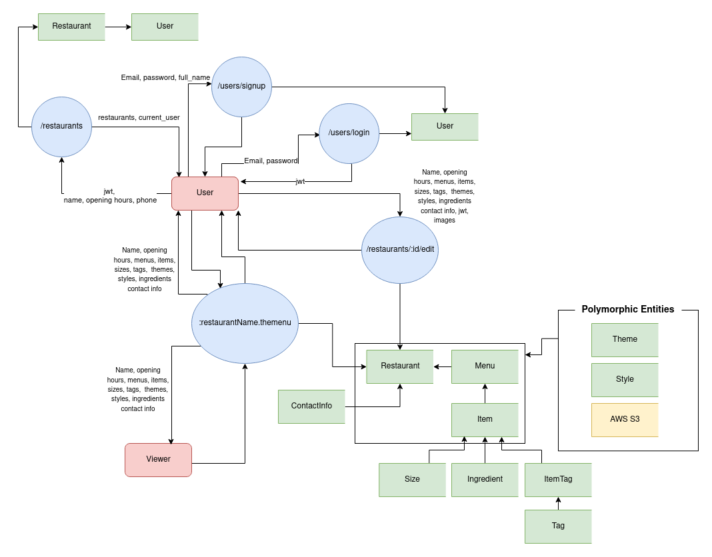
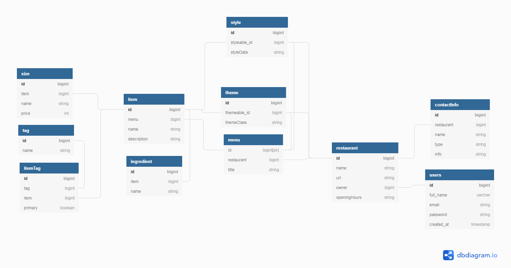

# Purpose

The Purpose of our app is to create a platform for small business owners to establish an online presence

# Features/Functionality

The final application should have the following features
- Account registration - User should be able to sign up for a new account
- Log in functionality - Registered User should be able to log in to their accounts
- Create a restaurant web page - A user should be able to create add a new restaurant
- Create/Add a menu to a restaurant - Users should have the ability to add one or more menus to their restaurants
- Create/Add items to menus - Users should be able to add items to their menus
- Tag items - Items should be able to have one or several different tags such as dietary information like vegan, gluten free etc.
- Add ingredients to items - A user should be able to add ingredients to their items
- Different sizes or prices - A user should be able to have different sizes of item that can have different prices. For examples glass of wine or bottle of wine.
- Pick different themes for restaurants, menus and items -  Users should be able to pick different layouts/themes for their restaurant page as well as the menus and items
- Pick different colours and styles for restaurant, menus and items - A user should be able to customize the colours, fonts and styles of their restaurant page, menu sections and each item in their menus.
- Add extra contact information - A user should be able to add additional information about their restaurant such as google maps link, phone number, social media or delivery service.
- Edit their webpage - Users should be able to edit their restaurant web page including themes, styles and information.
- Unique URls - Restaurants should have unique web urls
- View their webpage - Anybody should be able to view the restaurants webpage

# Target Audience

The target audience for this project is aimed specifically at small restaurant owners who may not have their own website or web presence. This service is to give those small business owner an opportunity to have an customizable webpage to show case their restaurant. This site could also be suitable for larger restaurant owners who want a quick and easy way to get some online presence without having to build their own website.

It will also target everyday restaurants customer who are looking for more information about local smaller restaurants online and want to see their menu offerings as well as filter through their menu depending on different criterias.0

# Tech Stack

Backend Language/Framework

    Ruby on Rails

Front End Framework

    React

Database

    PostgreSQL

Image Storage

    AWS S3 Buckets

External APIs

    Stripe

Version Control/Repo Hosting

    Git/Github

Deployment Services

    Heroku
    Netlify

# User Stories

## Restaurant Owners

My name is Jimmy Hendrix, I own a small juice bar called Jacked Juice. I wish to establish an online presence but don’t have the time or money to set up a complete website. I want to create an account. Fill out information about the items on my menu, then have a site generated for my restaurant displaying opening hours and street address. I also want to have a link to my Instagram on the site.

My name is Elon Tusk, I manage a small burger chain, each shop has a different menu. I already have an account with “final project name” and want to update opening hours of a restaurant as well as add a new item to a menu.

My name is Al Capone, I help out at my parents restaurant. They have a Hawaiian lunch and Italian dinner menu as well as a drinks and happy hour menu. I want to create a menu for each and have them themed accordingly.

My name is Dandrews, I run a small food truck. I don’t have the means to set up a complete website. I want to create a “final project name” site. Where I can display the hours and locations I operate my truck at, as well as the food available.

## Customers

My name is Angela Merkel, I’ve come to a new area of my city and am craving banana cake. I want to find a bakery that makes banana bread, when they’re open and how I can contact them. After googling local bakeries I find a “final project name” site that has a menu, opening hours and a phone number. I now enjoy cake

My name is Austin Powers, I have a favourite restaurant in my town and I wish to know more about their menu and the gluten free options available. I want to visit their “final project name” site, I want to organise the menu prioritising gluten free.

My name is The Zuck, I want to find out what my local Chilean restaurant offers for take away and their phone number. I also want to be able to find their vegan options available for takeaway.

# Dataflow Diagram

# Entity Relationship Diagram

# Application Architecture Diagram

